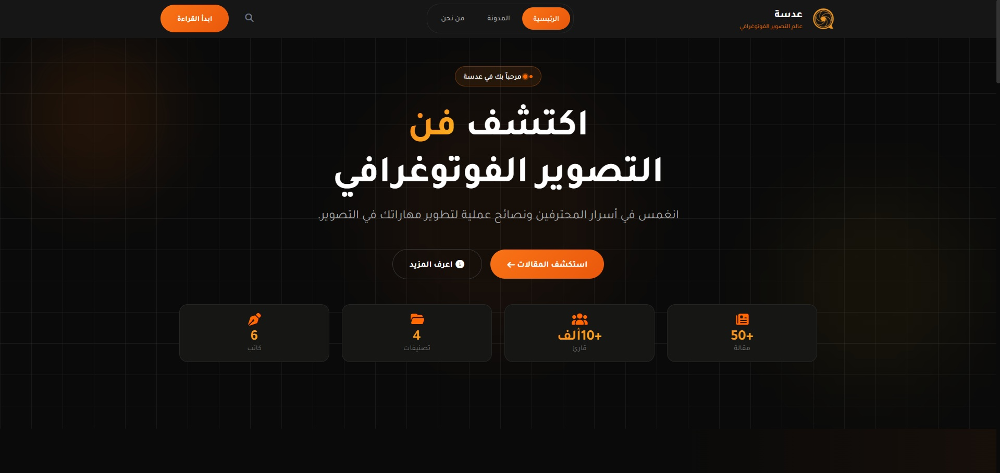
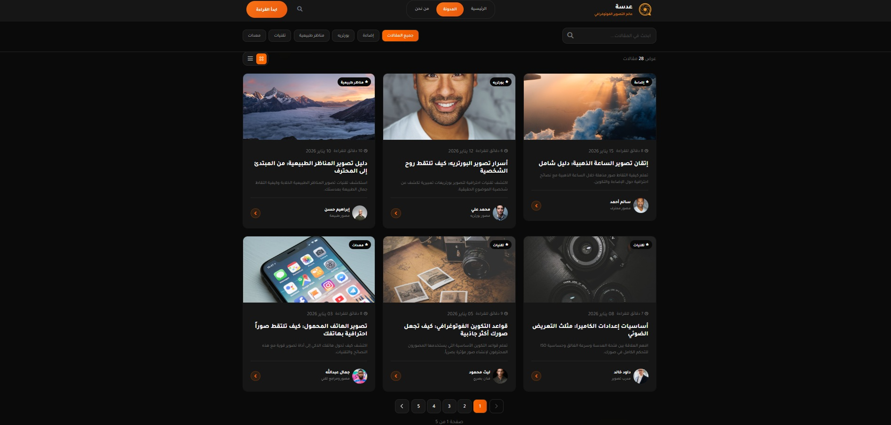
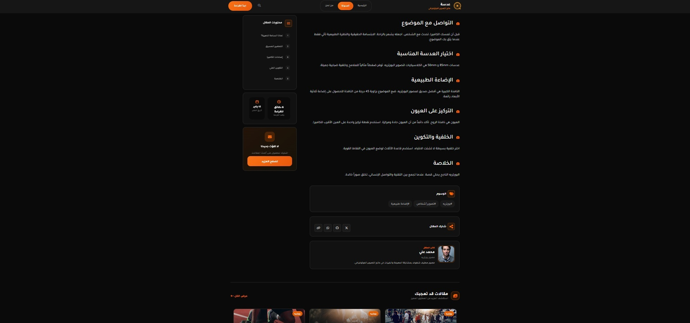
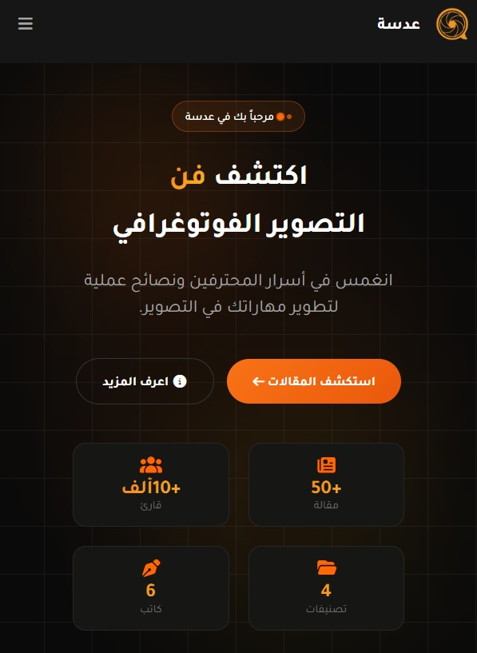

# Adasa Angular 🌐

Adasa Angular is a modern **Angular web application** styled with **Bootstrap**, featuring client-side routing and a blog section with dynamic routes.  
The project is deployed and publicly accessible using **GitHub Pages**.

🔗 **Live Demo:**  
https://abdalla20736.github.io/Adasa-Angular/

---

## 🚀 Features

- Built with **Angular**
- Styled using **Bootstrap**
- Fully responsive design
- Client-side routing
- Blog section with dynamic routes (`/blog/:slug`)
- Modular and clean project structure
- Deployed on **GitHub Pages**

---

## 🛠️ Tech Stack

- **Angular**
- **TypeScript**
- **Bootstrap 5**
- **HTML / CSS**
- **Angular Router**
- **GitHub Pages**

---

## 📸 Screenshots

### 🏠 Home Page

### 📝 Blog Page

### 📄 Blog Details Page

### 📱 Mobile View

